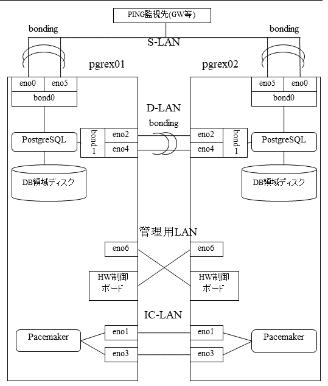

環境構築
========

本章では、ネットワークの構成、ディレクトリ構成、および、PG-REXのインストール手順を説明します。

ネットワーク
------------

PG-REXが推奨するネットワーク構成例を示します。この構成例では、各ノードにNWインターフェイスが7つある構成となっています。実際のノードのNWインターフェイスの数に応じてbonding等の設定を見直して環境を作成してください。本書では以下のIPアドレスを使用します。

※ ネットマスクはすべてのIPアドレスについて24 (255.255.255.0) とします。

-   S-LAN(運用LAN)
    :   -   pgrex01-bond0(eno0, eno5) : 192.168.0.11
        -   pgrex02-bond0(eno0, eno5) : 192.168.0.12
        -   ネットワーク監視先(ping) : 192.168.0.254
-   D-LAN(DBレプリケーションLAN)
    :   -   pgrex01-bond1(eno2, eno4) : 192.168.2.1
        -   pgrex02-bond1(eno2, eno4) : 192.168.2.2
-   IC-LAN(インターコネクトLAN)
    :   -   pgrex01-eno1 : 192.168.1.1
        -   pgrex01-eno3 : 192.168.3.1
        -   pgrex02-eno1 : 192.168.1.2
        -   pgrex02-eno3 : 192.168.3.2
-   STONITH-LAN
    :   -   pgrex01-eno6(管理LAN) : 172.20.144.41
        -   pgrex02-eno6(管理LAN) : 172.20.144.42
        -   pgrex01-HW制御ボード  : 172.20.144.43
        -   pgrex02-HW制御ボード  : 172.20.144.44

::: {custom-style="First Paragraph"}
　
:::

  

::: {custom-style="Figure Caption"}
ネットワーク構成例
:::

::: {custom-style="First Paragraph"}
　
:::

※ この図では、D-LANにおいてbonding設定を行ったNWインターフェイス同士を直接接続していますが、実際にはスイッチを介して接続することを推奨します。スイッチを使用せずに直接接続した場合、環境によってはOSによる故障検知に失敗する可能性があります。

::: {custom-style="page-break"}
　
:::

PG-REXでは、Primary側接続用、Standby側接続用、およびレプリケーション受付用の仮想IPアドレスを使用します。本書では、各仮想IPアドレスを以下のように設定することを前提とします。

-   S-LAN(運用LAN)
    :   -   Primary側接続用 : 192.168.0.10
        -   Standby側接続用 : 192.168.0.20
-   D-LAN(DBレプリケーションLAN)
    :   -   レプリケーション受付用 : 192.168.2.3

::: {custom-style="First Paragraph"}
　
:::

ディレクトリ構成
----------------

PG-REXのディレクトリ構成例を以下に示します。

::: {custom-style="First Paragraph"}
　
:::

  ------------------------------------------------------------------------
  [/var]{custom-style="Verbatim Char"}\
  [\ \ +\-lib]{custom-style="Verbatim Char"}\
  [\ \ \ \ \ +\-pgsql\ \.\.\.\.\.\.\.\.\.\ postgresユーザのホームディレクトリ]{custom-style="Verbatim Char"}\
  \
  [/dbfp]{custom-style="Verbatim Char"}\
  [\ \ +\-pgdata\ \.\.\.\.\.\.\.\.\.\.\.\ PostgreSQLのDBクラスタ格納先]{custom-style="Verbatim Char"}\
  [\ \ +\-pgwal]{custom-style="Verbatim Char"}\
  [\ \ |\ \ +\-pg_wal\ \.\.\.\.\.\.\.\.\ PostgreSQLのWAL格納先]{custom-style="Verbatim Char"}\
  [\ \ +\-pgarch]{custom-style="Verbatim Char"}\
  [\ \ \ \ \ +\-arc1\ \.\.\.\.\.\.\.\.\.\.\ PostgreSQLのアーカイブログ格納先]{custom-style="Verbatim Char"}

  ------------------------------------------------------------------------

::: {custom-style="First Paragraph"}
　
:::

この構成例では、PostgreSQLのDBクラスタ、WAL、アーカイブログの各格納先を別ディレクトリに配置しています。実際のディスク構成に応じて配置先を見直して環境を作成してください。ただし、両ノード（pgrex01とpgrex02）のディレクトリ構成は同一にしてください。

本書では、この構成例を前提に記述します。

::: {custom-style="page-break"}
　
:::

